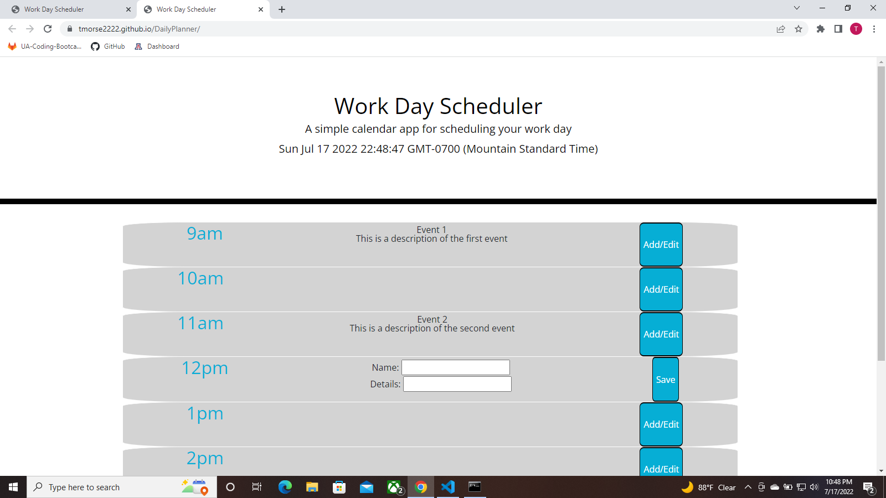

Tyler Morse 
Challenge 5: Work Day Scheduler 
Start Date: 07/15/22 
Most Recent Edit: 07/17/22 

 
User Story: 
AS AN employee with a busy schedule 
I WANT to add important events to a daily planner 
SO THAT I can manage my time effectively 
 
Acceptance Criteria: 
GIVEN I am using a daily planner to create a schedule 
WHEN I open the planner 
THEN the current day is displayed at the top of the calendar 
WHEN I scroll down 
THEN I am presented with time blocks for standard business hours 
WHEN I view the time blocks for that day 
THEN each time block is color-coded to indicate whether it is in the past, present, or future 
WHEN I click into a time block 
THEN I can enter an event 
WHEN I click the save button for that time block 
THEN the text for that event is saved in local storage 
WHEN I refresh the page 
THEN the saved events persist 
 
This challenge utilizes jQuery to allow for dynamic changes in HTML and CSS. Although provided starter HTML and CSS, heavy edits were made to both, while the JS script is original. The use of jQuery to create, change, and save HTML and CSS is the key feature of this application.

A link to the deployed application can be found <a href="https://tmorse2222.github.io/DailyPlanner/">here</a>